# NexusSpace

**An AI-assisted Learning Operating System — curriculum generated just-in-time, one tier at a time.**

🔗 Live: [nexusspace.tech](https://nexusspace.tech)

---

## What is this?

Most learning platforms hand you a fixed syllabus and move on regardless of whether you actually understood it. NexusSpace generates your curriculum dynamically — no pre-written course library, no static syllabus. You give it a topic, and it builds the learning path in real time, tier by tier, gated behind an actual mastery check.

Built as a final-year project, designed and architected end-to-end, with AI used heavily during implementation but every architectural decision — the tier hierarchy, the unlock logic, the regeneration-safety rules — made and owned personally.

## How it works

Content isn't pre-written — it's generated on demand, one tier at a time, and cached once created:

```
Learning Request
      │
      ▼
   Units (Tier 1)          — high-level modules for the topic
      │
      ▼
  Chapters (Tier 2)        — subtopics within a module
      │
      ▼
Lesson Nodes (Tier 3)      — individual lessons within a chapter
      │
      ▼
Learning Experience        — lesson content + flashcards + quiz
      │
      ▼
   Evaluation               — AI-graded submission
      │
      ▼
 Progress / Mastery         — unlocks the next node once earned
```

Nothing downstream generates until it's actually requested (just-in-time generation), and regenerating a tier cleanly replaces only what's obsolete beneath it — a learner's progress and evaluation history are never wiped out by a content refresh.

## Features

- **JIT curriculum generation** — units, chapters, and lessons are generated on request, not pre-authored
- **Mastery-gated progression** — the next node only unlocks after the AI evaluator confirms understanding
- **Multi-provider AI pipeline** — tiered generation split across Groq and Cerebras
- **Full auth system** — email/password with verification, Google + GitHub OAuth, JWT access + refresh tokens with rotation
- **Workspace-scoped content** — every unit, chapter, and lesson is owned and isolated per user
- **Defensive AI-response handling** — every AI provider call is validated and defaulted before it reaches the client, so a malformed model response degrades gracefully instead of breaking the page

## Tech stack

| Layer    | Tech                                                     |
| -------- | -------------------------------------------------------- |
| Frontend | React 19, Vite, TypeScript                               |
| Backend  | Node.js, Express 5, TypeScript                           |
| Database | MongoDB (Mongoose)                                       |
| Auth     | Passport (Google + GitHub OAuth), JWT (access + refresh) |
| AI       | Groq, Cerebras (multi-tier JIT generation)               |
| Email    | Resend                                                   |

## Screenshots

### Landing & Auth

| Home                               | Login                                | Registration                                       |
| ---------------------------------- | ------------------------------------ | -------------------------------------------------- |
| 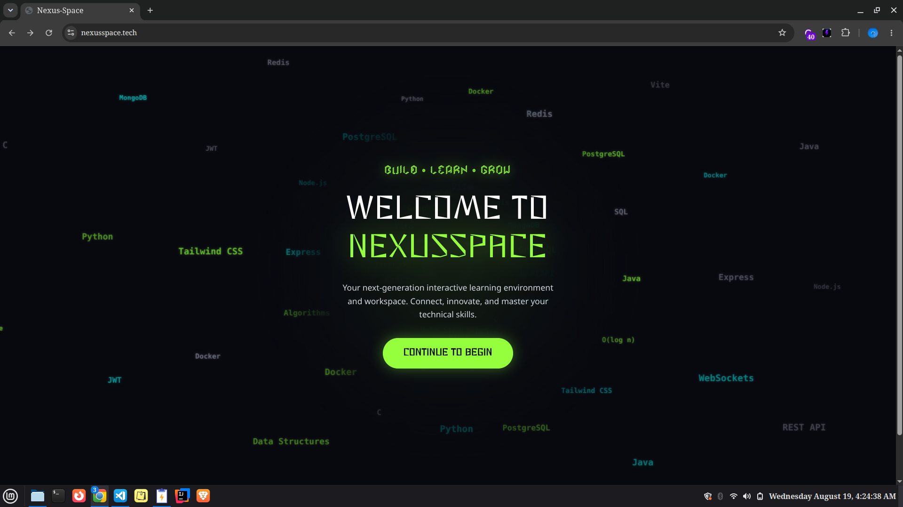 | 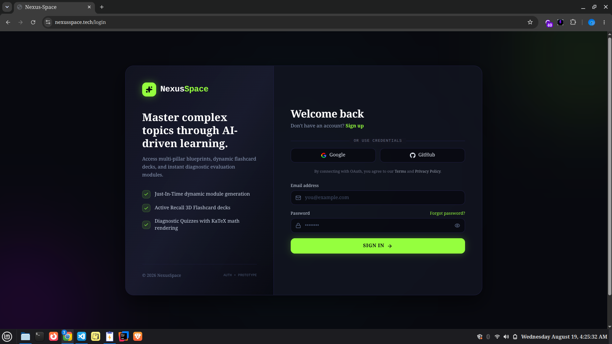 | 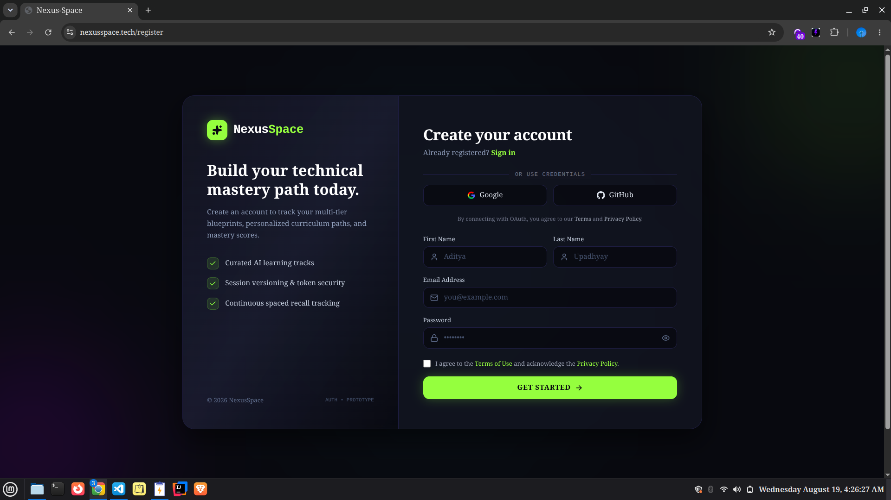 |

### Workspace & Curriculum

| Dashboard                          | Skills                                           | Create Workspace                                 |
| ---------------------------------- | ------------------------------------------------ | ------------------------------------------------ |
|  |  | 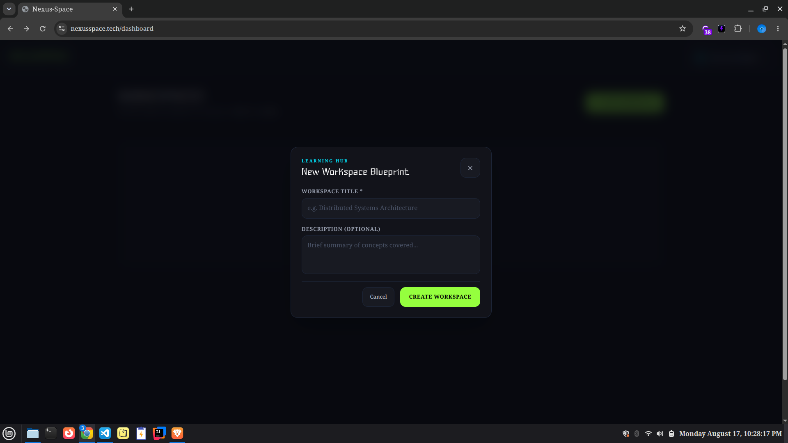 |

| Units                      | Chapters                         |
| -------------------------- | -------------------------------- |
| 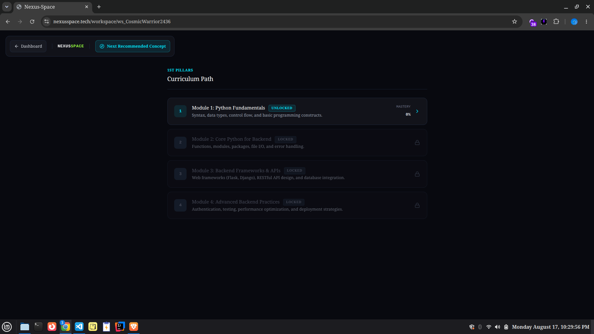 |  |

### Learning Experience

| Lesson List                            | Lesson Open                            | Lesson Regenerated                                   |
| -------------------------------------- | -------------------------------------- | ---------------------------------------------------- |
| 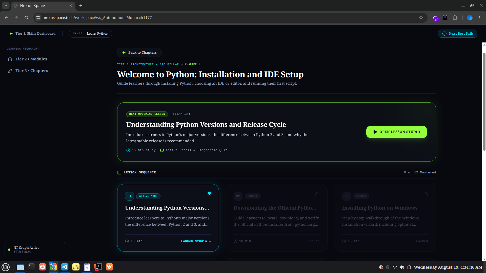 | 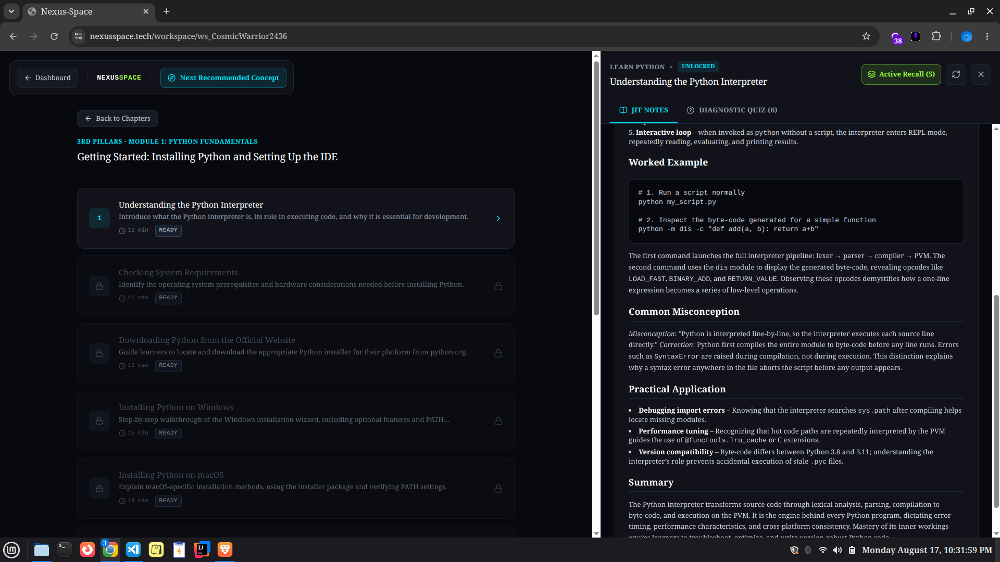 | 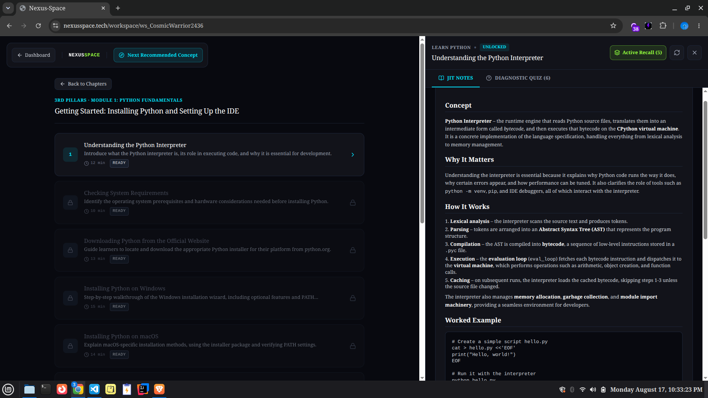 |

| Flashcards                           | Quiz                      |
| ------------------------------------ | ------------------------- |
|  | 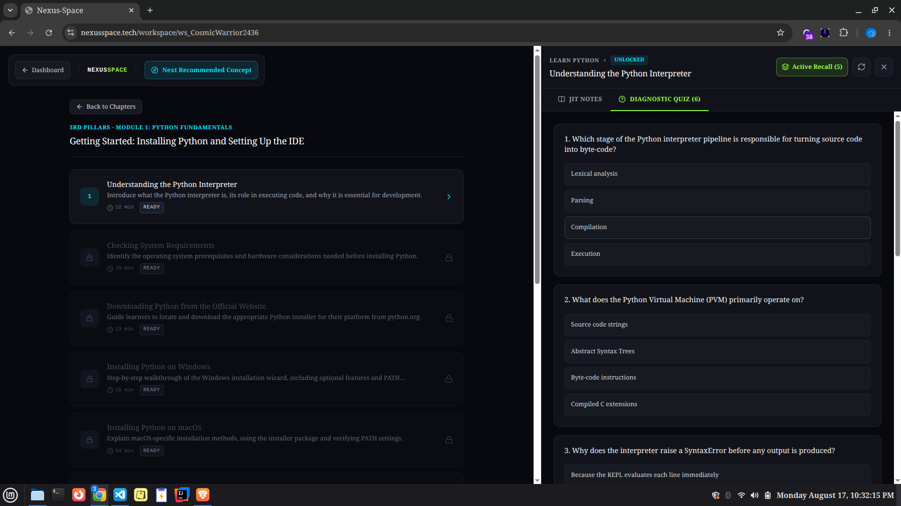 |

### Account & Legal

| Profile Settings                                      | Contact Developer                                 |
| ----------------------------------------------------- | ------------------------------------------------- |
| 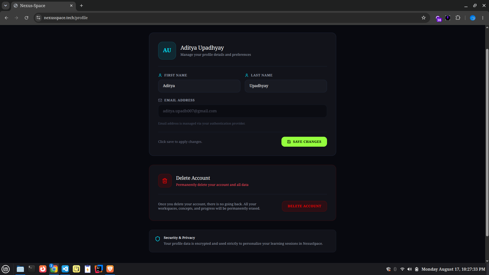 | 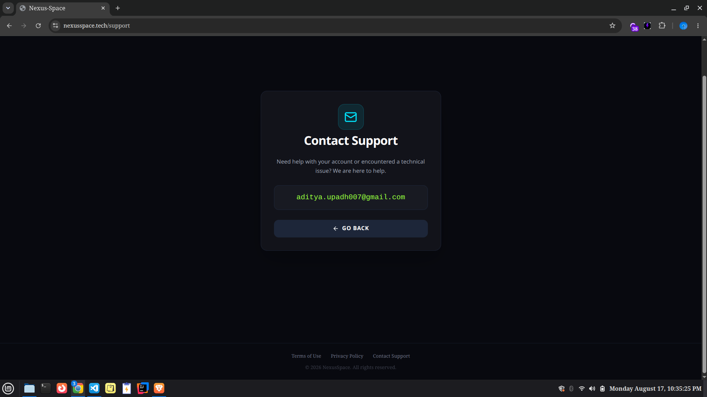 |

| Privacy Policy                               | Terms of Use                             |
| -------------------------------------------- | ---------------------------------------- |
| 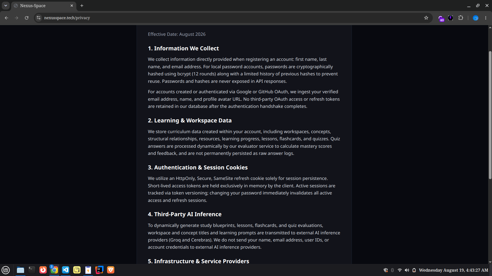 | 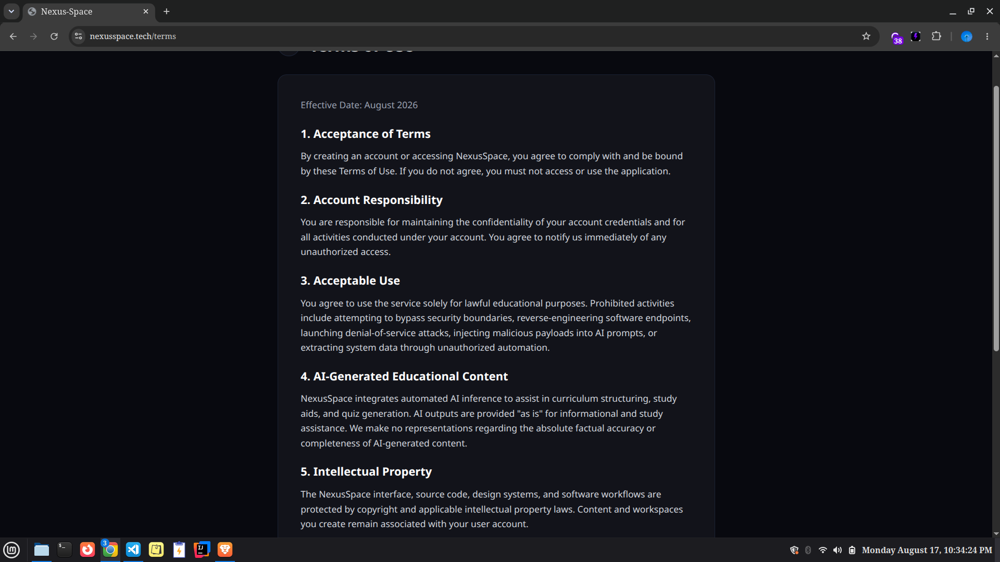 |

## Getting started

### Prerequisites

- Node.js 20+
- A MongoDB instance (Atlas free tier works fine)
- API keys for Groq / Cerebras, Resend, and OAuth apps (Google + GitHub)

### Setup

```bash
git clone https://github.com/<your-username>/nexusspace.git
cd nexusspace

# backend
cd backend
npm install
cp .env.example .env   # fill in the values below
npm run dev

# frontend
cd ../frontend
npm install
npm run dev
```

### Environment variables

Set these in `backend/.env` — check `src/config/env.ts` for the authoritative, up-to-date list:

| Variable                                           | Purpose                                            |
| -------------------------------------------------- | -------------------------------------------------- |
| `MONGO_URI`                                        | MongoDB connection string                          |
| `JWT_ACCESS_SECRET` / `JWT_REFRESH_SECRET`         | Token signing secrets                              |
| `JWT_ACCESS_EXPIRES_IN` / `JWT_REFRESH_EXPIRES_IN` | Token lifetimes                                    |
| `FRONTEND_URL`                                     | Allowed CORS origin                                |
| `GROQ_API_KEY` / `CEREBRAS_API_KEY`                | AI provider keys                                   |
| `GOOGLE_CLIENT_ID` / `GOOGLE_CLIENT_SECRET`        | Google OAuth                                       |
| `GITHUB_CLIENT_ID` / `GITHUB_CLIENT_SECRET`        | GitHub OAuth                                       |
| `RESEND_API_KEY`                                   | Transactional email (verification, password reset) |

## Project structure

```
backend/
  src/
    modules/        # identity, workspace, concept, resource, relationship, learning, ai
    middleware/      # auth, rate limiting, validation, error handling
    shared/          # errors, logger, utils
    config/          # env, database, passport

frontend/
  src/
    pages/
    components/
    contexts/        # auth context
    api/             # axios client + per-module API calls
```

## Notes on production hardening

This project went through a full security and reliability pass before launch: ownership checks on every resource, hashed refresh tokens, rate limiting on auth and AI endpoints, and defensive validation on every AI-generated response so a model hiccup never crashes a request.

## License

<!-- Pick one — MIT is a common default for student/portfolio projects -->

MIT

---

Built by Aditya Upadhyay as a final-year project.
