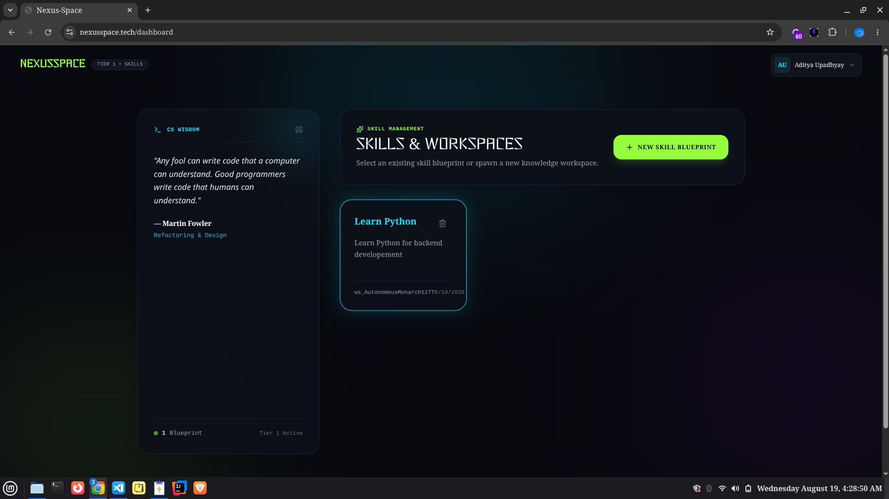
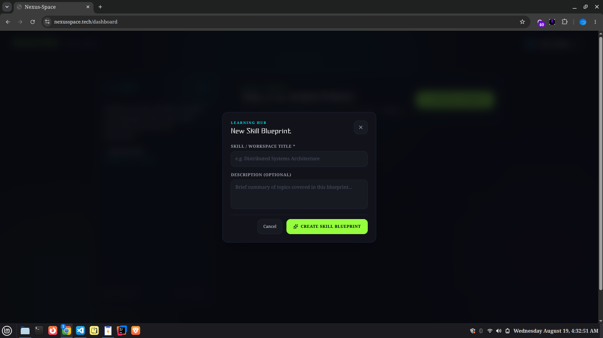
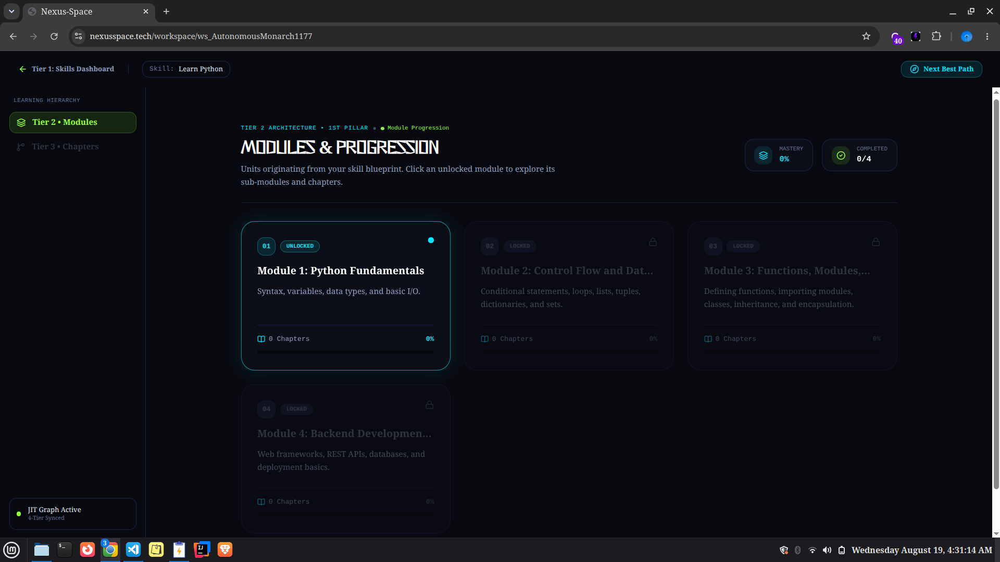
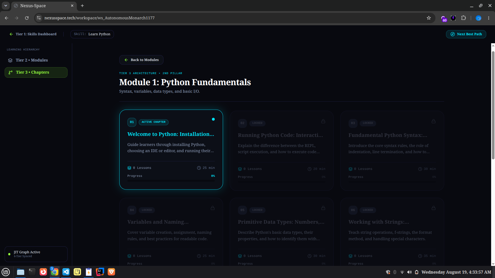
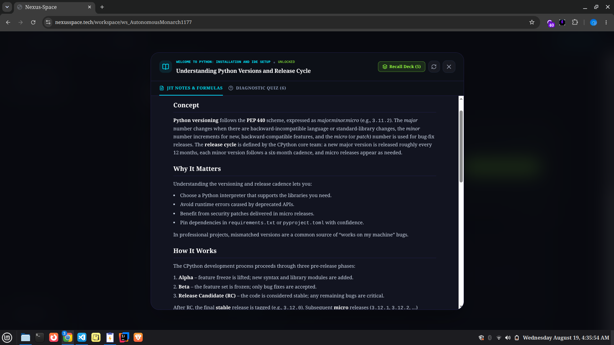
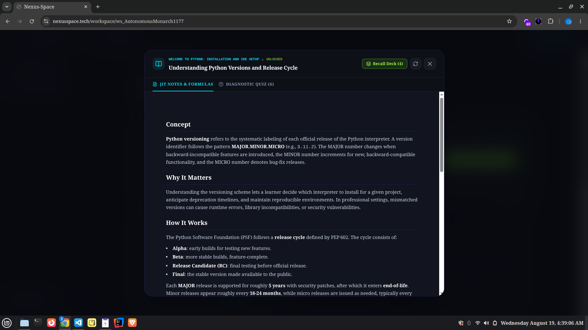
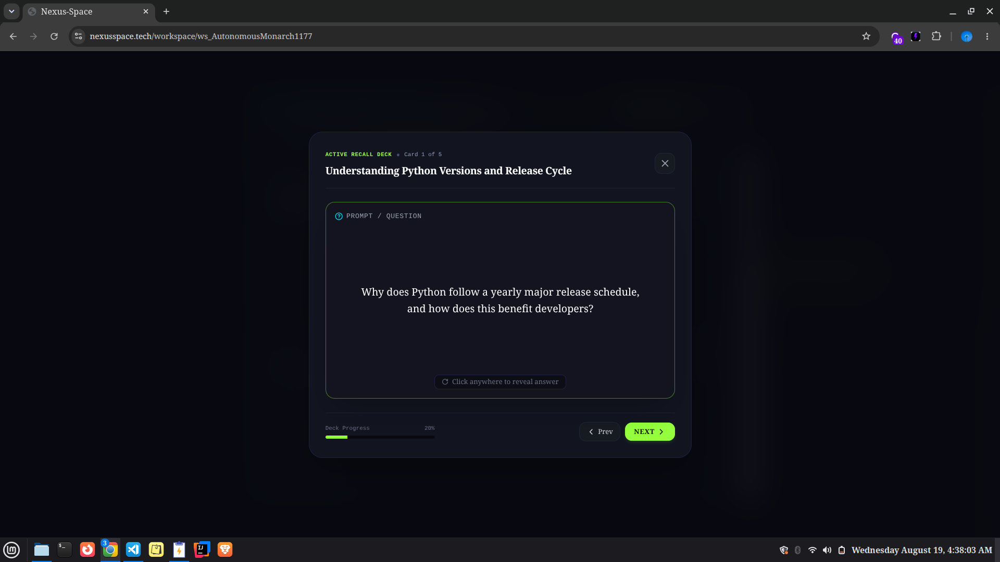
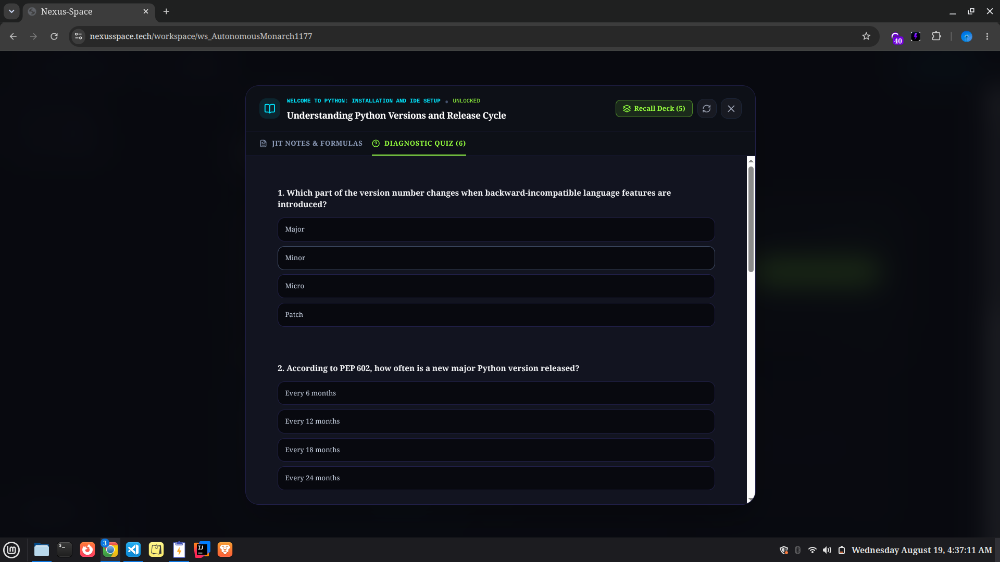

# NexusSpace

**An AI-powered Learning Operating System — curriculum generated just-in-time, one tier at a time.**

[](https://nexusspace.tech)
[](LICENSE)
[](https://nodejs.org)
[](https://www.typescriptlang.org/)

---

## What is this?

Most learning platforms give you a fixed syllabus — pre-written by someone else, at someone else's pace. NexusSpace does the opposite: you name a topic, and it builds a structured learning path in real time, tier by tier, gated behind an actual mastery check. No pre-built course library. No static syllabus. Nothing generates until you ask for it.

---

## How it works

Content is generated on demand, one tier at a time, and cached once created — so the first learner to request "Rust ownership model" pays the generation cost; every subsequent learner gets the cached version instantly.

```
Learning Request
      │
      ▼
   Units (Tier 1)          ← high-level topic modules
      │
      ▼
  Chapters (Tier 2)        ← subtopics within a module
      │
      ▼
Lesson Nodes (Tier 3)      ← individual lessons within a chapter
      │
      ▼
Learning Experience        ← lesson content + flashcards + quiz
      │
      ▼
   Evaluation              ← AI-graded submission
      │
      ▼
Progress / Mastery         ← unlocks next node only when earned
```

Regenerating a tier replaces only what's obsolete beneath it — a learner's evaluation history and progress state are never wiped by a content refresh.

---

## Architecture decisions

These are the non-obvious choices and why they were made.

**Why MongoDB over a relational DB for the knowledge graph?**
Concept-dependency edges (`DEPENDS_ON`, `USES`) have variable relationship types and the schema evolves as new topic domains are added. A document model with compound-indexed directed edges avoided costly migration overhead during iteration. The tradeoff is that complex graph traversals require application-level logic rather than SQL joins — acceptable here because traversal depth is bounded (typically 2–3 hops).

**Why two LLM providers instead of one with retry logic?**
Groq and Cerebras serve different tiers of the curriculum hierarchy. Each has different free-tier rate limits and cold-start latency profiles. Routing heavier Tier 1 generation (Units) to one provider and lighter Tier 3 generation (Lessons) to the other reduced p95 latency and gave a live fallback path rather than a degraded retry queue.

**Why JIT generation with caching rather than pre-generation?**
The topic space is effectively infinite — pre-generating is not feasible. JIT with MongoDB-level caching means cost is paid once per concept, not per user. The risk is cold-path latency on first generation, which is handled by optimistic UI and streamed partial responses.

**Why JWT access + refresh token rotation instead of sessions?**
The frontend and backend are deployed independently. Stateless access tokens eliminate the need for a shared session store. Refresh token rotation — where a used refresh token is immediately invalidated and a new one is issued — means a stolen token has a narrow window before it's revoked.

**Why Zod schema validation on every AI response rather than trusting the model?**
LLM output is non-deterministic. In early testing, roughly 1 in 8 generation calls returned malformed JSON or a structurally valid response that failed business rules (e.g. a lesson with no flashcards). Strict Zod validation with code-fence parsing and typed fallback defaults means a model hiccup degrades to a retryable state rather than a broken page.

---

## Features

- **JIT curriculum generation** — units, chapters, and lessons are generated on request; nothing is pre-authored
- **Mastery-gated progression** — the next node only unlocks after the AI evaluator confirms understanding
- **Multi-provider AI pipeline** — tiered generation split across Groq (Tier 1) and Cerebras (Tier 3) with validated fallbacks
- **Full auth system** — email/password with verification flow, Google + GitHub OAuth, JWT access + refresh tokens with rotation
- **Workspace-scoped content** — every unit, chapter, and lesson is owned and isolated per user; resource ownership is enforced at the API layer
- **Defensive AI-response handling** — every provider call runs through Zod schema validation + code-fence parsing before reaching the client
- **Rate limiting** — auth and AI-generation endpoints are rate-limited independently to prevent abuse and protect provider quotas
- **Hashed refresh tokens** — refresh tokens are stored as bcrypt hashes, not plaintext; a compromised DB doesn't expose active sessions

---

## Tech stack

| Layer    | Tech                                                          |
| -------- | ------------------------------------------------------------- |
| Frontend | React 19, Vite, TypeScript, Tailwind CSS                      |
| Backend  | Node.js 20, Express 5, TypeScript, Modular Domain Architecture |
| Database | MongoDB, Mongoose, compound-indexed relationship edges         |
| Auth     | Passport.js (Google + GitHub OAuth 2.0), JWT (access + refresh with rotation) |
| AI       | Groq API, Cerebras API, Zod schema validation, fallback defaults |
| Email    | Resend (transactional: verification, password reset)          |

---

## Screenshots

### Landing & Auth

| Home | Login | Registration |
|------|-------|--------------|
|  |  |  |

### Workspace & Curriculum

| Dashboard | Skills | Create Workspace |
|-----------|--------|-----------------|
|  |  |  |

| Units | Chapters |
|-------|----------|
|  |  |

### Learning Experience

| Lesson List | Lesson Open | Lesson Regenerated |
|-------------|-------------|-------------------|
|  |  |  |

| Flashcards | Quiz |
|------------|------|
|  |  |

### Account

| Profile Settings | Contact |
|-----------------|---------|
|  |  |

---

## Getting started

### Prerequisites

- Node.js 20+
- MongoDB instance (Atlas free tier works fine)
- API keys: Groq, Cerebras, Resend, Google OAuth app, GitHub OAuth app

### Setup

```bash
git clone https://github.com/madara-777-adi/Nexus.git
cd Nexus

# Backend
cd backend
npm install
cp .env.example .env   # fill in values — see table below
npm run dev

# Frontend (new terminal)
cd ../frontend
npm install
npm run dev
```

### Environment variables

Set these in `backend/.env`. See `src/config/env.ts` for the authoritative list with types and validation.

| Variable | Purpose |
|----------|---------|
| `MONGO_URI` | MongoDB connection string |
| `JWT_ACCESS_SECRET` / `JWT_REFRESH_SECRET` | Token signing secrets (use long random strings) |
| `JWT_ACCESS_EXPIRES_IN` / `JWT_REFRESH_EXPIRES_IN` | Token lifetimes (e.g. `15m` / `7d`) |
| `FRONTEND_URL` | Allowed CORS origin |
| `GROQ_API_KEY` / `CEREBRAS_API_KEY` | AI provider keys |
| `GOOGLE_CLIENT_ID` / `GOOGLE_CLIENT_SECRET` | Google OAuth 2.0 app credentials |
| `GITHUB_CLIENT_ID` / `GITHUB_CLIENT_SECRET` | GitHub OAuth app credentials |
| `RESEND_API_KEY` | Transactional email (verification + password reset) |

---

## Project structure

```
backend/src/
  modules/
    identity/      # user accounts, auth flows, token rotation
    workspace/     # user workspaces, topic scoping
    concept/       # knowledge graph nodes (topics, units, chapters, lessons)
    relationship/  # directed graph edges: DEPENDS_ON, USES
    resource/      # lesson content, flashcards, quiz items
    learning/      # progress tracking, mastery evaluation, unlock logic
    ai/            # LLM provider clients, prompt templates, Zod validators
  middleware/
    auth/          # JWT verification, resource ownership guards
    rate-limit/    # per-route rate limiting for auth + AI endpoints
    validation/    # request body validation
    error/         # centralized error handling, typed AppError
  shared/
    errors/        # error classes and HTTP status mapping
    logger/        # structured logging
    utils/
  config/
    env.ts         # validated environment config (throws on startup if missing)
    database.ts    # Mongoose connection setup
    passport.ts    # OAuth strategy registration

frontend/src/
  pages/           # route-level page components
  components/      # reusable UI components
  contexts/        # AuthContext (user state, token management)
  api/             # axios client + per-module typed API functions
```

---

## Production hardening

Before launch, the project went through a deliberate security and reliability pass:

- **Resource ownership** — every data-mutating endpoint checks that the authenticated user owns the target resource before executing, not just that they're logged in
- **Hashed refresh tokens** — refresh tokens stored as bcrypt hashes; the plaintext is sent once at issuance and never persisted
- **Auth rate limiting** — login and registration endpoints rate-limited to prevent brute-force and credential stuffing
- **AI endpoint rate limiting** — generation endpoints rate-limited independently from auth to protect Groq/Cerebras quotas
- **Defensive AI validation** — every AI response is parsed through Zod schemas with typed fallbacks; a malformed model response triggers a retryable error state, never a runtime crash
- **Multi-document transaction fallbacks** — progress and evaluation state updates use Mongoose transactions to stay consistent during JIT content regenerations

---

## What I'd change at scale

This section is for engineers evaluating the architecture — here's where the current design has known tradeoffs and how I'd address them under real load:

- **JIT cold-path latency** — first-generation requests block until the AI call completes. At scale, this would move to a background job queue (BullMQ + Redis) with SSE or WebSocket updates to the client, rather than a synchronous HTTP response.
- **Single-node MongoDB** — the knowledge graph and content collections would benefit from read replicas and Atlas Search for concept similarity queries.
- **No observability** — currently logging only. The next step is structured logs shipped to a log aggregator (e.g. Logtail) and error tracking via Sentry.
- **AI provider coupling** — the Groq/Cerebras split is hard-coded by tier. A provider abstraction layer with configurable routing would allow adding or swapping models without touching business logic.

---

## License

MIT

---

Built by [Aditya Upadhyay](https://github.com/madara-777-adi).
